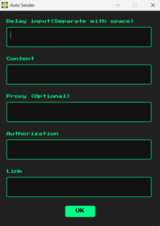

#  Auto Sender Discord App

A simple and efficient desktop application built with **PyQt5** that allows you to automatically send messages to Discord using customizable delays, proxy options, and authorization tokens.  
This project provides a clean, user-friendly interface with real-time status updates through an info window.

---

##  Screenshots

###  Main Window


###  Info Window


---

##  Installation Guide

Follow the steps below to install and run the application on your computer:

1. **Clone the repository**
   ```bash
   git clone https://github.com/ferizkyy/Auto-Sender-Discord-App.git
   ```

2. **Navigate into the project directory**
   ```bash
   cd Auto-Sender-Discord-App
   ```
   
4. **Run the application**
   For mofied
   ```bash
   python Auto-sender.py
   ```
   Or, if you want run the original executable file:
   Open Auto-sender.exe, or
   
   ```bash
   Auto-sender.exe
   ```

---

## How to Use

### 1️. Input Delay
You can enter **multiple delay values** separated by spaces.  
Each delay represents the number of seconds between messages.  
**Example:**
```
10 20 30 40
```
This means the app will wait 10s, then 20s, then 30s, then 40s between each message.

---

### 2️. Content
In the **Content** box, simply type the message you want to send.  
The app will automatically send it to the given link(s).

---

### 3️. Proxy (Optional)
If you wish to protect your IP or avoid rate limits, you can use a proxy.  
Enter your proxy in the following format:
```
http://username:password@ip:port
```
If you don’t want to use a proxy, just leave this field empty.

---

### 4️. Authorization Code
You’ll need your Discord **authorization token** to send messages.  
Follow these steps to obtain it:


1. Click F12 in your keyboard to enter developer mode
   


Click Network

2. Send 1 massage
   


Click massage request 

3. Find request headers
   


Input your authorization code
   


---

### 5️. Link (Webhook or Channel URL)
Provide the **message link** or **webhook link** where messages should be sent.

1. Click F12 in your keyboard to enter developer mode
   


Click Network

2. Send 1 massage
   


Click massage request

3. In general you can see the url
   


Input to the link with Request URL

---

##  Features

-  Send multiple messages automatically  
-  Customizable delay for each message  
-  Real-time info window with progress display  
-  Optional proxy support  
-  Simple and intuitive user interface  

---
